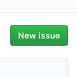
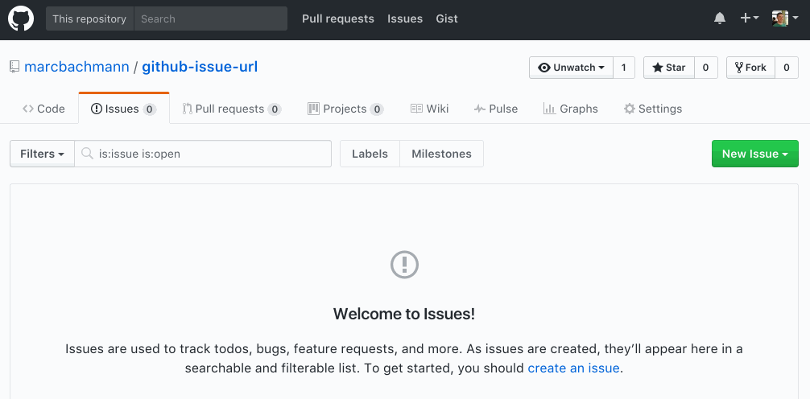

<!-- This file is generated from /README.tpl.md. Please don't edit the one in the root director -->

#  Github Issue Templates

At livingdocs we're actively using github for all our projects. One missing feature we want in github is to be able to chose from a list of issue templates.

This code is a first try to improve the current behavior. In this codebase you can find a CLI which is able to extract templates from one file and offers a simple templating setup for the README to render them in a list.

There's also a chrome extension in here that benefits of the same code to render a template chooser on the github issue page.

### Example

Create a new issue from one of those templates:<br>

&nbsp;&nbsp;[Bug](http://github.com/marcbachmann/github-issue-templates/issues/new?title=Bug%3A%20%3CYour%20Problem%3E&amp;body=%23%20Bug%20issue%20template%0ALorem%20ipsum%20dolor%20sit%20amet%2C%20consectetur%20adipiscing%20elit.%0ACurabitur%20vitae%20lobortis%20ante.%20Vivamus%20metus%20magna%2C%20fringilla%20vel%20euismod%20id%2C%20interdum%20ultricies%20metus.%0A%0ADuis%20iaculis%2C%20ex%20et%20eleifend%20lacinia%2C%20magna%20augue%20ullamcorper%20mi%2C%0Asit%20amet%20gravida%20mauris%20metus%20vel%20ex.%20Proin%20ut%20tellus%20eget%20sem%20mollis%20mattis%20non%20tincidunt%20orci.%0AAliquam%20imperdiet%20quam%20vel%20mi%20vehicula%20viverra.%0A%0ACurabitur%20commodo%20pellentesque%20risus%2C%20et%20tristique%20mi%20cursus%20eu.%0AVestibulum%20commodo%20laoreet%20posuere.%20Vestibulum%20aliquet%20sed%20lacus%20sit%20amet%20semper.%0AEtiam%20molestie%20nunc%20odio%2C%20a%20sodales%20sem%20dictum%20a.%0ANam%20consectetur%20dapibus%20urna%2C%20vitae%20dignissim%20arcu%20cursus%20ac.&amp;labels[]=bug&amp;labels[]=help%20wanted&amp;assignee=marcbachmann)&nbsp;|&nbsp;[Documentation](http://github.com/marcbachmann/github-issue-templates/issues/new?title=Documentation%3A%20%3CYour%20text%3E&amp;body=%23%20Documentation%20issue%0A%0A*%20%5B%20%5D%20Foo%0A*%20%5B%20%5D%20Bar%0A*%20%5B%20%5D%20Test&amp;labels[]=question&amp;assignee=marcbachmann)

Those links/templates are generated out of the templates file in .github/ISSUE_TEMPLATES.md

You can use the chrome extension to automatically load that file and render dropdown on the github issue page.

Example of the chrome extension:


### Usage

Create the file `.github/ISSUE_TEMPLATES.md`.  
Check the content in [github-issues-templates/.github/ISSUE_TEMPLATES])(./.github/ISSUE_TEMPLATES.md) for an example config.

```bash
# Run
$ npm install github-issue-templates -g
$ github-issue-templates

# the previous command has those defaults
$ github-issue-templates --source ./README.tpl.md --destination ./README.md

# the help lists all options
$ github-issue-templates --help
```
